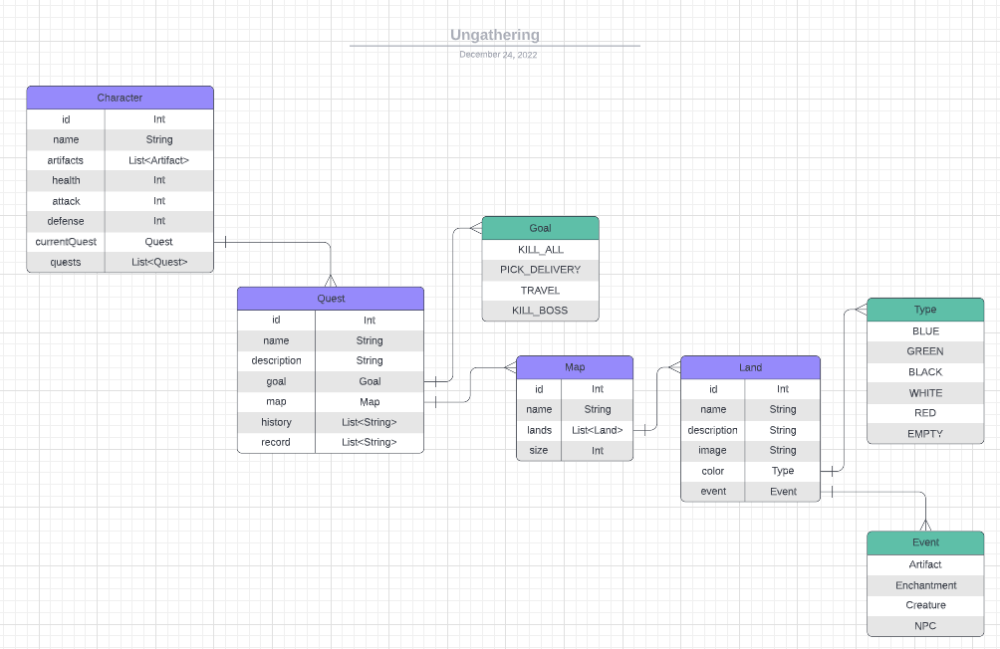

# Ungathering
**Magic The Gathering solo role-play mobile game**

Auto-generated role-play adventure where the random encounters will be with MTG creatures, enchantments, artifacts, and lands.

The game is not closed to tight rules as expected for a mobile game, there is some room for roleplay and dice rolls - 
the player will be responsible to create storytelling connecting all random encounters. During the game, the application will allow the user 
to record voice. Then each adventure will have a recorded story attached, together with the history of encounters and dice results.

## Features

📝 **Character sheet**

The player needs to create a character sheet with stats, inventory, and other attributes.
The player will be allowed to edit this information at any moment.

📐 **Settings**

The player can set how the map will be generated - length, difficulty, and types of lands.
The player can decide if he wants to enable voice record during the adventure.
The player can set to use real dice or virtual dice.

🗺️ **Generated Map**

Each hex is a land type and has a random encounter according to land type.
Player has a pin marking their position on the map.

📍 **Movement**

The character can move in any direction on the map using keys.
When the player arrives at a new position, an encounter appears - combat, NPC interaction, shop, loot, etc.

🎲 **Encounters**

There is an algorithm to calculate encounter level using character level and MTG mana cost cards.

⚔️ **Combat**

When facing an MTG creature, there are some rules of combat according to creature attack/defense and character attributes, with dice.

📖 **History**

All movements, encounters, and combat results are organized in a text history.

🎙️ **Voice Record**

The user can add voice notes to the history, adding flavor to the encounters.

## Entities

